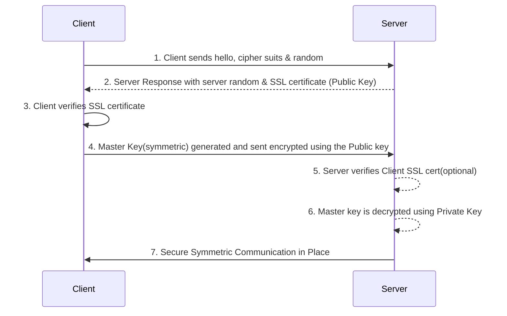

# SSL/TLS - Basics

- **SSL** refers to Secure Sockets Layer, used to encrypt connections
- **TLS** refers to Transport Layer Security, which is a newer version
- Nowadays, **TLS certificates are mainly used**, but people still refer as SSL
 

- Public SSL certificates are issued by Certificate Authorities (CA)
- Comodo, Symantec, GoDaddy, GlobalSign, Digicert, Letsencrypt, etc ...
 

- SSL certificates have an expiration date (you set) and must be renewed
  

# SSL Encryption - How it works

- Asymmetric Encryption is expensive (SSL)
- Asymmetric handshake is used to exchange a per-client random symmetric key
- Possibility of client sending an SSL certificate as well(two-way certificate)

 

# SSL - Server Name Indication(SNI)

- SNI solves the problem of loading **multiple SSL certificates onto one web server**(to serve multiple websites)
- IT's a "newer" protocol, and requires the client to **indicate** the hostname of the target server in the initial SSL handshake
- The server will then find the correct certificate, or return the default one

  - Note:
    - Only works for ALB & NLB(newer generation), CloudFront
    - Dos not work for CLB(older gen)
 

# SSL - Man in the Middle Attack
## How to prevent

1. Don't use public-facing HTTP, use HTTPS (meaning, use SSL/TLS certificates)
2. Use a DNS that has DNSSEC
   - To send a client to a pirate server, a DNS response needs to be "forged" by a server which intercepts them
   - It is possible to protect your domain name by configuring DNSSEC
   - **Amazon Route 53 supports DNSSEC for domain registration**
   - **Route 53 supports DNSSEC for DNS service as of December 2020 (using KMS)**
   - You could also run a custom DNS server on Amazon EC2 for example (**BIND** is the most popular, dnsmasq, KnotDNS, PowerDNS)
